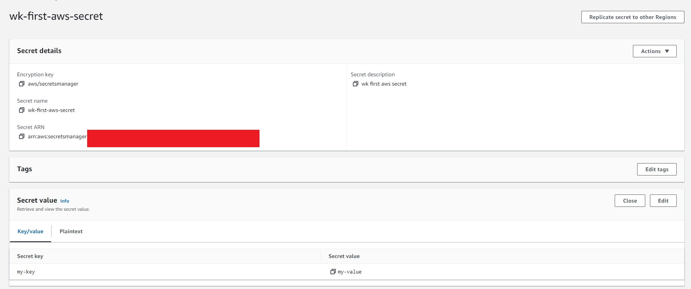

# External Secrets Operator Demo

## Setting up External Secrets Operator

1. Install ESO, either via OperatorHub or using subscription file

        oc apply -f subscription.yaml

1. Apply OperatorConfig

        oc apply -f operator-config.yaml

## AWS Secret Manager

1. Create a programatic access user and generate Access Key & Secret Access Key.

2. Create a custom policy and attach to this user, refer to [aws-policy.json](aws/aws-policy.json)

3. Create a dummy secret in AWS SM.

    

4. Test out using `aws cli`

        $ aws configure --profile sample-profile
        AWS Access Key ID [None]: YOUR-ACCESS-KEY
        AWS Secret Access Key [None]: YOUR-SECRET-ACCESS-KEY
        Default region name [None]: YOUR-REGION
        Default output format [None]: yaml

        $ export AWS_PROFILE=sample-profile

        $ aws secretsmanager get-secret-value --secret-id wk-first-aws-secret
        ARN: arn:aws:secretsmanager:YOUR-ARN
        CreatedDate: '2023-07-06T20:54:21.074000+08:00'
        Name: wk-first-aws-secret
        SecretString: '{"my-key":"my-value"}'
        VersionId: a2004df5-b147-476d-973c-6f512492bdf5
        VersionStages:
        - AWSCURRENT

## Use External Secret to pull and create an OpenShift secret

1. Create a Project called `external-secrets` in OpenShift

1. Create a Secret containing the access key and secret access key

        oc apply -f secret.yaml

1. Create a SecretStore, which will hold the reference to the secret

        oc apply -f secret-store.yaml

1. Create an ExternalSecret, which will tell the ESO where to get the AWS secret and where to create the OpenShift secret

        oc apply -f external-secret.yaml

1. Verify `wk-first-aws-secret-actual` is created.